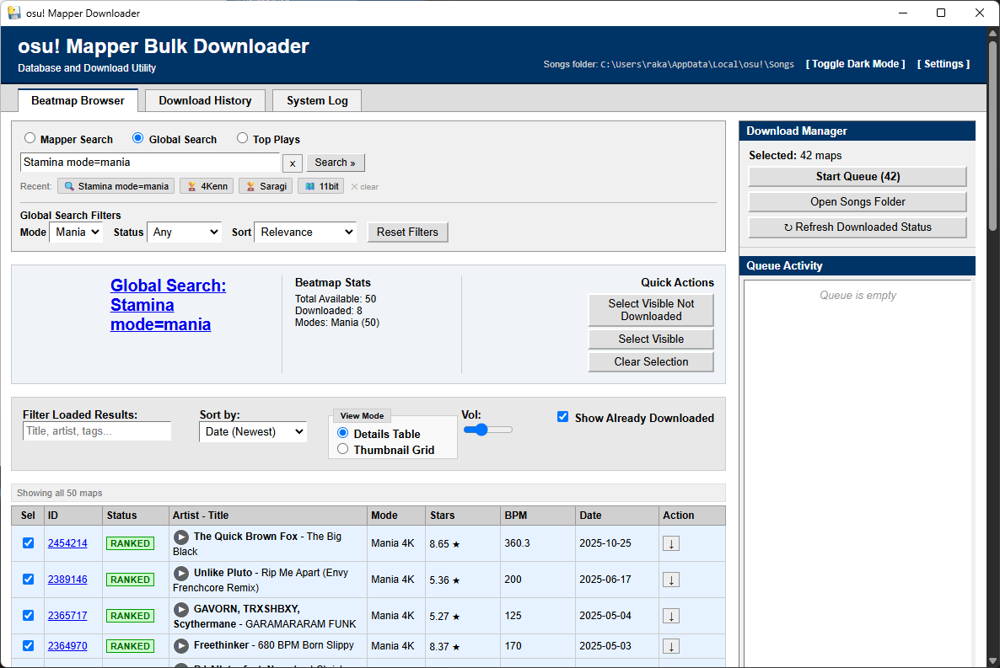

# osu! Map Bulk Downloader

A lightweight, local desktop application built with Python (Flask/pywebview) designed for osu! players who want a streamlined way to discover and bulk-download beatmaps. 

Whether you're trying to farm new maps, grab your favorite mapper's entire catalog, or simply explore the global database, this tool bypasses the tedious process of downloading maps one by one from the browser.

## Key Features

- **Bulk Download from Specific Mappers**: Instantly search a mapper's username and pull their entire ranked, loved, or graveyard catalog into a download queue.
  <br>

- **Download Other Players' Top Plays**: Enter a player's username (e.g. "mrekk") to instantly load their top plays and bulk-download the maps.
  <br>

- **Global Search**: Search the entire osu! database using normal search syntax (e.g. `stars>7 bpm>200`), just like you would on the main website.
  <br>

## Download & Installation
You do **not** need to install Python or build the app yourself! 

[📥 Click here to download OsuMapperDownloader.exe](../../releases/latest/download/OsuMapperDownloader.exe)


1. Download the `OsuMapperDownloader.exe` file using the link above.
2. Double-click to run it! 

*Note: On your very first launch, the app will open a Configuration window. You will need to provide an osu! OAuth Client ID and Secret (which you can easily generate from your osu! account settings), along with the path to your osu! `Songs` folder.*

## Running from Source (For Developers)
1. Clone the repository.
2. Install dependencies:
   ```cmd
   pip install -r requirements.txt
   ```
3. Run the application:
   ```cmd
   python app.py
   ```

## Building the EXE
A helper script is provided to compile the application into a single standalone executable.
```cmd
.\build.bat
```
The resulting executable will be placed in the `dist\` folder.

## Disclaimer
This is an unofficial community tool and is not affiliated with ppy Pty Ltd.
